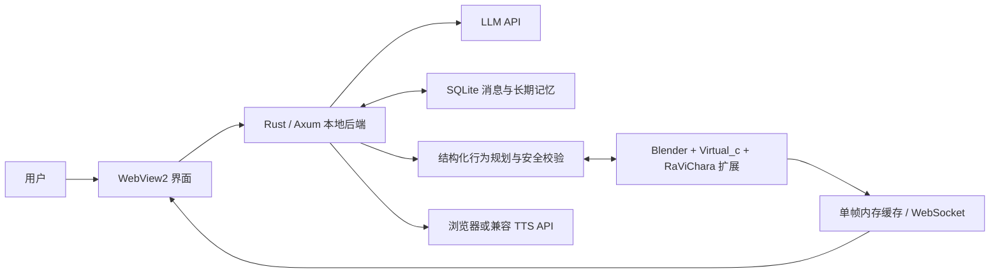

# RaViChara

RaViChara 是一个面向 Windows 的本地桌面虚拟角色实验项目。它把流式对话、可持久化记忆、语音合成与 Blender 人物控制放入同一套运行时，目标是在不要求用户输入骨骼或动作命令的前提下，让角色的文本、表情、姿态和画面反馈保持一致。

开发这一项目的直接原因，是希望得到一个可控、可检查、可长期运行的实时可视化交互 chatbot。现阶段的重点不是生成复杂动画本身，而是建立一条可维护的控制链：模型只描述有限且结构化的行为意图，本地后端依据当前 Blender 场景实际暴露的骨骼、IK/FK、形态键和限制完成校验、映射与执行。这样可以降低固定动作与不同 PMX/MMD 骨架不匹配的概率，也避免把未经校验的模型输出直接交给 Blender。

当前版本仍属于个人研究和工程验证阶段。未来若时间允许，会继续优化响应延迟、骨架适配、动作表现和长期运行稳定性；在现有外部视频接口的基础上，也可能进一步研究由 AI 实时生成并响应对话的视频流。

## 当前版本

| 组件 | 版本 | 兼容性含义 |
|---|---:|---|
| RaViChara 桌面应用 | `0.6.0` | 使用语义化版本；本次包含默认主题、角色资源和发布结构调整 |
| Blender 扩展 | `0.5.5` | 独立于桌面应用发布，版本不要求相同 |
| Blender 桥接协议 | `4` | 仅在通信结构不向后兼容时递增 |

版本规则和兼容矩阵见 [docs/VERSIONING.md](docs/VERSIONING.md)。

## 系统结构



桌面程序使用 Winit、Wry 和系统 WebView2 承载现有前端；Axum、SQLite、WebSocket 与桌面窗口位于同一进程。运行时不依赖 Node.js、Tauri CLI 或独立浏览器。

## 已实现范围

- 对话：支持 OpenAI-compatible Chat Completions，并为 LM Studio 提供原生请求路径。内置 LM Studio、Ollama、OpenAI、DeepSeek、阿里云百炼/Qwen、SiliconFlow、智谱 GLM、OpenRouter、Groq、Gemini、Mistral、小米 MiMo 和自定义供应商入口。Base URL、模型名和 API key 均可在设置中修改。
- 角色卡：读取项目原生 YAML/YML/JSON 卡；公开分发只附带原创 Lily 示例卡和抽象 SVG 头像。切换角色时按角色隔离聊天数据库与记忆数据库。
- 长期记忆：保存原始消息，提取并去重事实，按相关度、重要度和时间召回，旧消息可合并为分层情节。默认不设消息、事实和情节的硬删除上限；启用阈值后也只清理已归档原文。
- Blender 控制：发现当前场景、模型、骨架、约束和形态键，按实际 RigProfile 生成临时关键帧计划。扩展包含 PMX/MMD 常见 A/T Pose 待机校准、IK/FK 通道选择、动作结束回待机、表情控制和相机帧回传。
- 低成本画面：Blender 不可用时，界面可以使用角色立绘和有限的 2D idle、wave、nod、walk、表情反馈。
- 外部视频：支持标准 HTTP(S) 视频或 MJPEG/连续图像地址。项目不保存视频帧，可用于接入自建推理、ComfyUI 或其他视频服务。
- 语音：支持浏览器 Web Speech 识别；TTS 支持关闭、浏览器 SpeechSynthesis、OpenAI、小米 MiMo 和自定义 OpenAI-compatible 接口。历史角色消息可以重新调用合成，不写入持久音频缓存。
- 桌面封装：生成 Windows x64 便携目录和 ZIP，EXE 带应用图标；配置、历史和 WebView2 profile 均有明确的数据目录。

## 能力边界

文本回复和画面控制并非同一个生成任务。后端优先使用模型工具调用或结构化行为规划取得意图，再与 Blender 当前报告的能力求交集。未被骨架、约束或形态键清单确认的控制项会被拒绝或降级。因此：

- 更大的 LLM 通常能改善意图理解和结构化输出稳定性，但不能自动修复未知骨骼、错误权重、混合 IK/FK 或不可用形态键。
- “实时”指文本流与画面反馈不互相阻塞，不等于渲染零耗时。延迟仍取决于模型首 token、行为规划请求、Blender 场景复杂度和相机渲染时间。
- Blender 扩展会限制计划规模并复用临时 Action，但复杂 PMX 场景仍应先备份 `.blend`，并通过压力测试确认稳定性。
- 外部视频接口只负责显示上游输出，不在本项目内实现视频模型推理。

更完整的模块说明见 [docs/ARCHITECTURE.md](docs/ARCHITECTURE.md)，Blender 安装和诊断见 [docs/BLENDER_SETUP.md](docs/BLENDER_SETUP.md)。

## 默认界面

无本地自定义图片或已保存主题时，界面使用米白主题：

| 区域 | 默认颜色 |
|---|---|
| 主界面无图底色 | `#FEF3C7` |
| 用户消息气泡 | `#B6EBEC` |
| 顶部信息栏与强调色 | `#9FF3FE` |
| 角色与提示消息框 | `#FFFFFF` |
| 渲染框背景 | `#BDBBF7` |

自定义背景、头像和主题仍保存在本机。删除 `webview/` 只会重建浏览器 profile；不会删除 `data/` 中的聊天、长期记忆或 API 设置。

## 运行

### 要求

- Windows 10/11 x64；
- Microsoft Edge WebView2 Runtime；
- Rust stable，`minimal` profile 即可；
- 一个兼容的 LLM 服务；
- Blender 仅在使用 3D 画面与动作时需要。

项目的测试和构建不依赖 `rustfmt` 或 `clippy`。

### 启动桌面程序

默认配置指向 LM Studio：

```text
http://127.0.0.1:1234/v1
qwen3.5-9b-uncensored-hauhaucs-aggressive
```

启动：

```powershell
cargo run --locked --offline
```

仅启动 HTTP 服务：

```powershell
cargo run --locked --offline -- --server
```

默认 Web 地址为 `http://127.0.0.1:8760`。首次使用在线供应商时，在设置页选择供应商并填写 Base URL、模型与 API key。运行时设置写入 `data/overrides.json`；设置接口不会向页面回传密钥明文。该文件被 `.gitignore` 排除，不应提交。

## Blender

当前桥接需要 Virtual_c 服务监听 `127.0.0.1:9876`，并安装项目扩展：

```text
blender_addons/ravichara_preview_bridge-0.5.5.zip
```

扩展不另开端口，而是在同一调度器上增加 RigProfile、临时动作、待机回归和相机帧能力。画面并不是持续写入磁盘的视频：Blender 4.5 相机渲染会使用唯一的临时 PNG 作为 Render Result 到 Python 字节的兼容边界，读取后立即删除；后端只在内存中保留最新一帧，并通过无积压 WebSocket 交给 UI。

具体安装、帧尺寸/相机比例、MCP 配置与故障定位见 [docs/BLENDER_SETUP.md](docs/BLENDER_SETUP.md)。

## 数据与磁盘占用

```text
data/overrides.json       本机运行设置和 API key
data/memories/*.db        按角色保存的消息、事实与情节
logs/ravichara.log        运行日志
webview/                  WebView2 浏览器 profile，可重建
target/                   Rust 构建缓存，可重建
dist/                     打包结果，可重建
```

聊天记录和长期记忆位于 `data/`，不会因清理画面缓存而删除。Blender 帧、外部视频帧和 TTS 音频不写入持久缓存。发布包默认不包含本机 `data/`；即使使用私有数据打包选项，脚本也会清除 API key 与 Blender token。

## 测试与打包

```powershell
cargo test --locked --offline
cargo build --release --locked --offline
node --check static/app.js
.\scripts\package_windows.ps1
```

当前打包输出：

```text
dist/RaViChara-0.6.0/
dist/RaViChara-0.6.0-Windows-x64-portable.zip
blender_addons/ravichara_preview_bridge-0.5.5.zip
```

需要把当前数据库放入仅供本人使用的便携包时：

```powershell
.\scripts\package_windows.ps1 -IncludeUserData
```

详细规则见 [docs/DESKTOP_BUILD.md](docs/DESKTOP_BUILD.md)。

## GitHub 发布

仓库提供 Windows CI 和按版本标签发布的工作流。公开推送前应先运行：

```powershell
.\scripts\release_preflight.ps1
```

发布前检查会拒绝已跟踪的本机数据、密钥、构建缓存、崩溃日志和私有角色资源。甘雨等用户自行导入的卡与图片通过 `.gitignore` 保留在本机，不进入源码仓库或公共便携包。角色卡模板和字段要求见 [docs/CHARACTER_CARDS.md](docs/CHARACTER_CARDS.md)。

确认版本、测试、许可证和工作区均无问题后，可将远端设为 `origin`，提交代码，再创建与应用版本一致的标签：

```powershell
git tag -a v0.6.0 -m "RaViChara 0.6.0"
git push origin main
git push origin v0.6.0
```

标签会触发 `.github/workflows/release.yml`，构建 Windows 便携包、生成 SHA-256 文件并创建 GitHub Release。也可以在 GitHub 的 Releases 页面手动建立草稿、上传 ZIP 与校验文件后再发布。

## 目录

```text
src/config.rs             配置、供应商预设与本机覆盖
src/persona.rs            角色卡解析和系统上下文
src/llm/                  LLM 协议与流式响应
src/memory/               SQLite、召回、事实和分层情节
src/blender/              Blender 客户端与行为规划
src/mcp.rs                内置 MCP 工具入口
src/server/               Axum API、静态资源和 WebSocket
src/desktop.rs            Windows WebView2 桌面宿主
static/                   前端 UI
characters/               默认角色卡与头像
blender_addons/           Blender 扩展与验证脚本
scripts/                  测试、打包和发布前检查
```

## 版权与许可证

项目源代码按 [MIT License](LICENSE) 提供。第三方角色、角色卡、图片、商标以及 Blender 本身不包含在该许可授权范围内，详见 [THIRD_PARTY_NOTICES.md](THIRD_PARTY_NOTICES.md)。

默认 Lily 示例卡及抽象 SVG 头像为项目原创示例，可随源代码分发。甘雨等用户自行导入的角色卡和图片仅保存在本机且不属于本项目授权范围。使用者有责任确保导入的角色卡、模型、图片、声音和 API 服务符合其许可证与服务条款。
